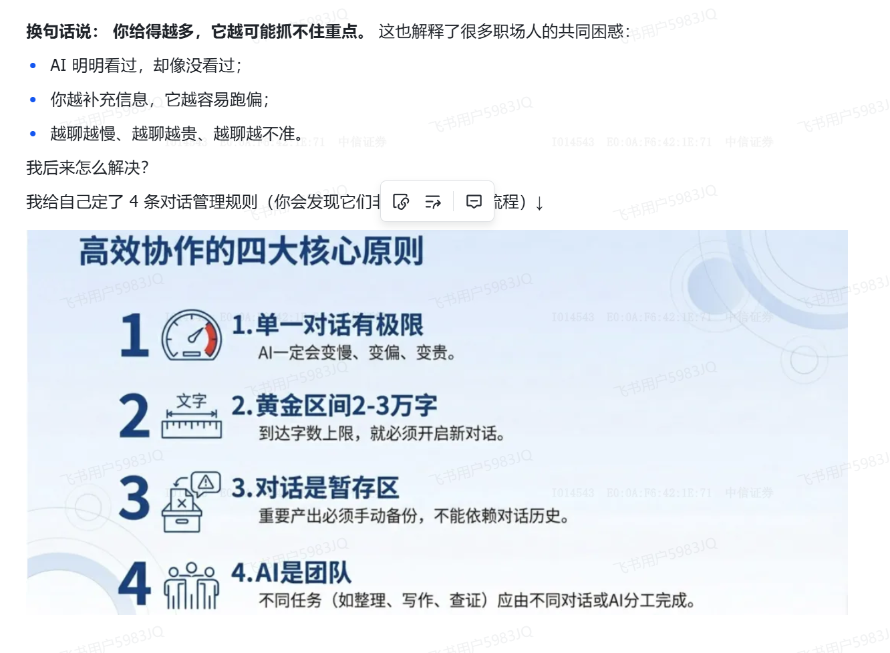
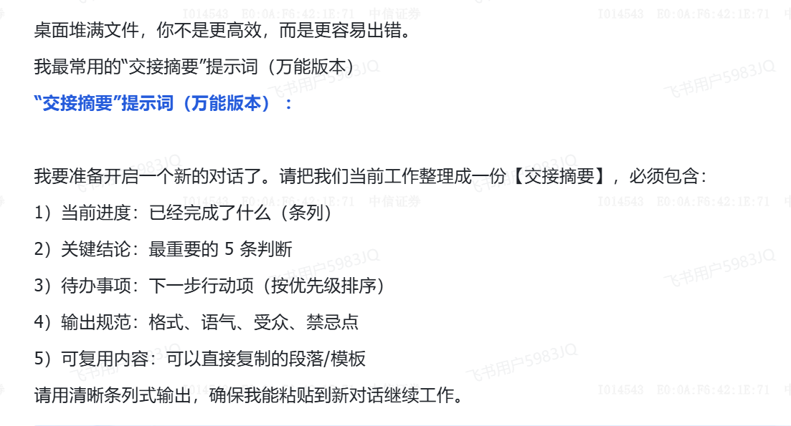

一些提示词积累。
## 好的项目

| url                                                                                                                                                     | 简记                                                                            |
| ------------------------------------------------------------------------------------------------------------------------------------------------------- | ----------------------------------------------------------------------------- |
| [Enhance_your_prompts_with_meta_prompting](https://github.com/openai/openai-cookbook/blob/main/examples/Enhance_your_prompts_with_meta_prompting.ipynb) | 来自openai-cookbook/examples /Enhance_your_prompts_with_meta_prompting.ipynb |
| [aishort提示词库](https://www.aishort.top/)                                                                                                                 | 比较早收藏的                                                                        |
| [AutoPrompt Studio](https://github.com/Eladlev/AutoPrompt)                                                                                              | Intent-based Prompt Calibration(tencent1)                                     |
| [PromptBreeder](https://github.com/vaughanlove/PromptBreeder)                                                                                           | Google DeepMind's PromptBreeder(tencent2), 2024 ICML                          |
| [promptomatix](https://github.com/SalesforceAIResearch/promptomatix)                                                                                    | 比较新的(2025)项目                                                                  |
|                                                                                                                                                         |                                                                               |
|                                                                                                                                                         |                                                                               |
|                                                                                                                                                         |                                                                               |
|                                                                                                                                                         |                                                                               |
|                                                                                                                                                         |                                                                               |

## 对话原则：

一条对话控制在2~3万字，若回答效果降低，就要换聊天框，换之前可以先提取摘要：

最后手动备份对话记录：

## Claude Agent上下文结构
- **Your prompt：** 告诉 Agent 这次具体要做什么
- **References：** 告诉 Agent 这次任务参考哪些具体材料，可以是 specs、mockups、code、HTML artifact；
- **System prompt：** 告诉 Agent 它是谁、在哪里工作
- **CLAUDE.md：要轻量，重点写项目坑点；** 告诉 Agent 这个项目有什么特殊约定
- **Skills：是轻量指南，需要时加载；** 告诉 Agent 做某类任务时按什么流程
- **Memory：** 告诉 Agent 长期偏好和背景

